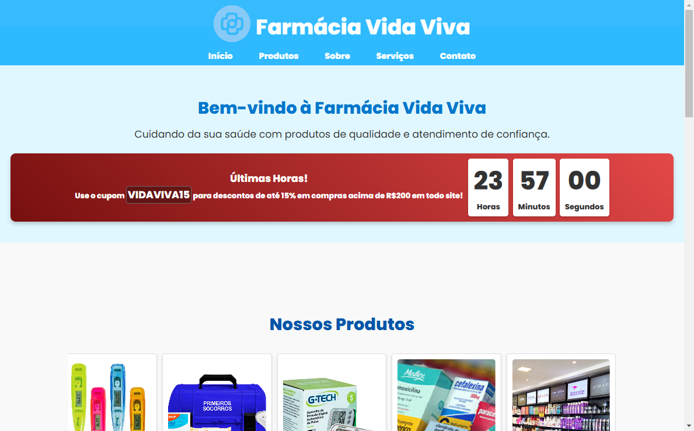

#  Farmácia Vida Viva

Bem-vindo ao repositório da Farmácia Vida Viva! Este é um projeto desenvolvido como parte do curso de **Gestão em Tecnologia da Informação** da Universidade Cruzeiro do Sul. O objetivo do projeto é criar um site institucional para uma farmácia, proporcionando aos clientes uma experiência fácil e eficiente ao navegar por medicamentos, promoções e serviços oferecidos pela farmácia.



## Índice

- Objetivo
- Descrição do Projeto
- Como Utilizar
- Tecnologias Utilizadas
- Estrutura do Projeto
- Funcionalidades
- Funcionalidades Futuras
- Contribuições
- Contato
- Relatório do Projeto
- Observações

## 🎯 Objetivo

O objetivo deste projeto é criar um site para a **Farmácia Vida Viva**, proporcionando aos clientes uma experiência fácil e eficiente ao navegar pelos nossos produtos, medicamentos e serviços. O site visa disponibilizar informações relevantes, como a localização da farmácia, horário de funcionamento e promoções especiais.

Este projeto foi desenvolvido como parte das atividades do curso de **Gestão em Tecnologia da Informação** da Universidade Cruzeiro do Sul e visa aplicar os conhecimentos adquiridos em HTML, CSS e JavaScript.


## 📖 Descrição do Projeto 

O site "Farmácia Vida Viva" foi desenvolvido para ser uma plataforma acessível e prática para nossos clientes. O layout é simples e intuitivo, facilitando o acesso às informações. O projeto utiliza tecnologias modernas como HTML5, CSS3 e JavaScript para garantir uma boa experiência de navegação.

## 🕹️ Como Utilizar

1. **Acessar a Página**:
   - Acesse a aplicação hospedada clicando [aqui](https://farmaciavivavida.vercel.app).
   - Ou abra o arquivo `index.html` localmente no navegador para visualização offline.

2. **Interaja com a Navegação**:
   - O menu permite que você acesse as diferentes seções da página.
   
3. **Visualize os Produtos**:
   - O site exibe informações sobre os produtos em destaque.

## 🛠️ Tecnologias Utilizadas 


 

- **HTML5**: Para a estruturação do conteúdo.
- **CSS3**: Para estilização e design responsivo.
- **JavaScript**: Para interação e funcionalidades adicionais, como a exibição de produtos, promoções e a navegação no site.

## 🗂️ Estrutura do Projeto 

A organização dos arquivos no projeto é a seguinte:

```
| index.html
| README.md
| assets/
| ├── css/
| │   ├── style.css
| ├── images/
| │   └── [imagens e ícones]
| └── js
|     └── scripts.js
```

## ⚙️ Funcionalidades 

- Página inicial com promoções.
- Navegação fácil entre as seções.
- Exibição de produtos em destaque.
- Informações de contato e localização.
- Design responsivo para dispositivos móveis.

## 🌟 Funcionalidades Futuras

- Transformar o site em e-commerce.
- Implementar sistema de busca de produtos.
- Pagina de cadastro do cliente.
- Separar produtos por categorias.
- Adicionar funcionalidade de carrinho de compras.
- Integrar com sistemas de pagamento online.


## 🤝 Contribuições

Contribuições são bem-vindas! Para contribuir:

- **Abra uma Issue:** Relate um bug ou sugira uma melhoria.
- **Crie um Pull Request:** Faça alterações no código e envie uma solicitação para revisão.

## 📧 Contato

Para dúvidas ou feedback, entre em contato:

- **E-mail:** [nina.kastro@icloud.com](mailto:nina.kastro@icloud.com)
- **LinkedIn:** [LinkedIn](https://www.linkedin.com/in/karinacmartins/)
- **GitHub:** [GitHub](https://github.com/karinacmartins)

## 📄 Relatório do Projeto

O relatório enviado para a faculdade pode ser acessado através do link abaixo:

- [Relatório do Projeto](https://docs.google.com/document/d/1D99fIHAGojnhCCiyBkmwaXGxENVMJVkA/edit?usp=drive_link&ouid=116413050875749529271&rtpof=true&sd=true)

Este documento detalha a situação-problema, os objetivos, as soluções aplicadas e os aprendizados adquiridos durante o desenvolvimento deste projeto.


## Observações

Este projeto é uma representação de como uma farmácia pode ter uma presença online para servir seus clientes com mais eficiência.

<br>
<br>

  <div align="right">Made with 💜 by <a href="https://github.com/karinacmartins">KM</a>.</div>
